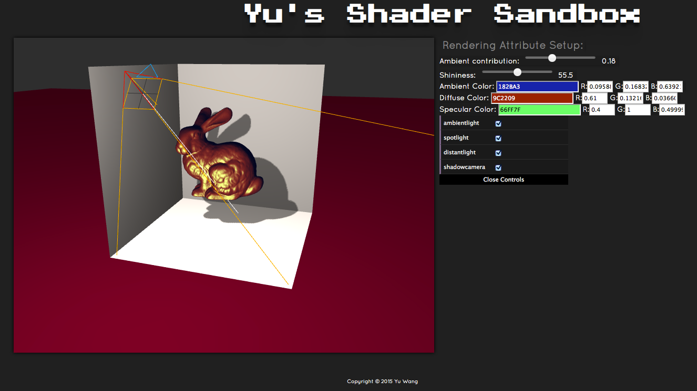

# Shader Sandbox
GNU GENERAL PUBLIC LICENSE, Version 2

* Developer: Yu Wang

* This is a minimum shader sandbox for ambient+specular+diffuse shading testing
  - On load, the Stanford bunny is loaded with ambient+specular+diffuse shading enabled with shadows
  - Use mouse to drag within the scene to use orbit camera
  - Rendering attributes can be interactively editted to change the appearance of the bunny
    + ambient contribution
    + specular hightlight size
    + ambient light color
    + diffuse color
    + specular hightlight color
  - Three lights are in the scene, which can be enabled/disabled by checking/unchecking the box
    + ambient light
    + spot light
    + distant light
  - Wireframe of the shadow camera can be set to be visible/invisible by checking/unchecking the box
* External Javsscript Libraries used:
  - three.js.min.js
  - OrbitControls.js
  - Stats.js
  - OBJLoader.js
  - jscolor.js
  - dat-gui.js

* If you find this project interesting or helpful, please feel free to contact me at wang.yu@umbc.edu
